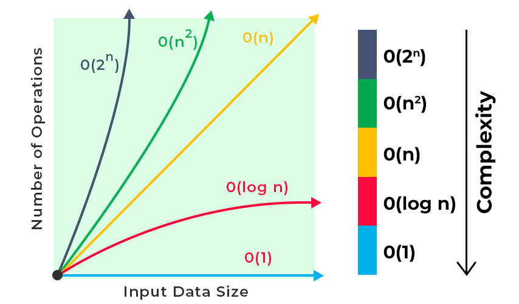

# Python Cheat Sheet

A Cheat Sheet 📜 to **revise** Python syntax in **less time**. Particularly useful for solving Data Structure and Algorithmic problems or a quick overview before an interview.

> [Click here for similar Java Resource (not made by me)](https://drive.google.com/file/d/1ao4ZA28zzBttDkuS6MLQI52gDs_CJZEm/view) <br>
> Get a PDF of this sheet at the end. <br>
> Leave a ⭐ if you like the cheat sheet (contributions welcome!) <br>

# Table of Contents
- [Basics](#basics)
- [Data Structures](#data-structures)
  - [Lists](#lists)
  - [Dictionary](#dictionary)
  - [Counter](#counter)
  - [Deque](#deque)
  - [Heapq](#heapq)
  - [Sets](#sets)
  - [Tuples](#tuples)
  - [Strings](#strings)
- [Built-in Functions](#built-in-functions)
- [Advanced Topics](#advanced-topics)
- [Best Practices](#best-practices)
- [Tips & Gotchas](#tips--gotchas)

# Basics

## Data Types


## Operator Precedence



```python
value = float('-inf')
value = float('-inf')
```
# Data Structures

## Lists
Time Complexities:

### Python List (Array) Time Complexity

## Python `list` (Array) — Time & Space Complexity (DSA)

| Operation | Example | Time | Space | DSA Notes |
|---------|--------|------|-------|----------|
|Create val list|[val] * len(arr)| O(1) | O(1) | Init |
| Create empty | `arr = []` | O(1) | O(1) | Init |
| Create with values | `[1,2,3]` | O(n) | O(n) | Allocation |
| Access by index | `arr[i]` | O(1) | — | Core operation |
| Assign by index | `arr[i] = x` | O(1) | — | Overwrite |
| Length | `len(arr)` | O(1) | — | Stored internally |
| Append | `arr.append(x)` | O(1)* | O(1) | Amortized |
| Extend | `arr.extend(b)` | O(m) | O(1) | Add iterable |
| Insert (middle) | `arr.insert(i,x)` | O(n) | O(1) | Shift elems |
| Pop last | `arr.pop()` | O(1) | O(1) | Stack use |
| Pop index | `arr.pop(i)` | O(n) | O(1) | Shift elems |
| Remove value | `arr.remove(x)` | O(n) | O(1) | Search + shift |
| Clear | `arr.clear()` | O(n) | O(1) | Reset |
| Copy | `arr.copy()` | O(n) | O(n) | New list |
| Slice | `arr[a:b]` | O(k) | O(k) | Copy slice |
| Reverse (in place) | `arr.reverse()` | O(n) | O(1) | Two pointers |
| Sort (in place) | `arr.sort()` | O(n log n) | O(1) | Timsort |
| Sorted copy | `sorted(arr)` | O(n log n) | O(n) | New list |
| Membership test | `x in arr` | O(n) | — | Linear search |
| Index of value | `arr.index(x)` | O(n) | — | First match |
| Count value | `arr.count(x)` | O(n) | — | Frequency |
| Min / Max | `min(arr)` / `max(arr)` | O(n) | — | Scan |
| Sum | `sum(arr)` | O(n) | — | Accumulate |
| Iterate | `for x in arr:` | O(n) | — | Visit all |
| Enumerate | `enumerate(arr)` | O(n) | — | Index + value |
| Concatenate | `a + b` | O(n+m) | O(n+m) | New list |
| Repeat | `arr * k` | O(nk) | O(nk) | Copy elems |
```python
nums = [1,2,3]

# Common Operations
nums.index(1)      # Find index
nums.append(1)     # Add to end
nums.insert(0,10)  # Add 10 from left (at index 0 which is start)
nums.remove(3)     # Remove value
nums.pop()         # Remove & return last element
nums.sort()        # In-place sort (TimSort: O(n log n))
nums.reverse()     # In-place reverse
nums.copy()        # Return shallow copy

# List Slicing
nums[start:stop:step]  # Generic slice syntax
nums[-1]    # Last item
nums[::-1]  # Reverse list
nums[1:]    # Everything after index 1
nums[:3]    # First three elements
```

### Python `set` (HashSet)
HashSet is implemented as a hash table, and hash table lookups are constant time on average.

```python
key
```
Example:
```python
{"apple", "banana"}
```

:heavy_exclamation_mark: stores only unique elements
:heavy_exclamation_mark: automatically removes duplicates

| Operation | Example | Time | Space | DSA Usage |
|---------|--------|------|-------|----------|
| Create | `s = set()` | O(1) | O(1) | Init |
| Create from list | `set(nums)` | O(n) | O(n) | Remove duplicates |
| Add element | `s.add(x)` | O(1) | O(1) | Track seen |
| Remove element | `s.remove(x)` | O(1) | O(1) | Must exist |
| Discard element | `s.discard(x)` | O(1) | O(1) | Safe remove |
| Pop arbitrary | `s.pop()` | O(1) | O(1) | Rarely used |
| Membership test | `x in s` | O(1) | — | Core operation |
| Length | `len(s)` | O(1) | — | Count unique |
| Iterate | `for x in s:` | O(n) | — | Visit all |
| Clear | `s.clear()` | O(n) | O(1) | Reset |
| Copy | `s.copy()` | O(n) | O(n) | Duplicate |
| Union | `s | t` / `s.union(t)` | O(n + m) | O(n + m) | Merge |
| Intersection | `s & t` / `s.intersection(t)` | O(min(n,m)) | O(min(n,m)) | Common elems |
| Difference | `s - t` / `s.difference(t)` | O(n) | O(n) | Remove elems |
| Symmetric diff | `s ^ t` | O(n + m) | O(n + m) | XOR |
| Update | `s.update(t)` | O(m) | O(1) | In-place union |
| Intersection update | `s.intersection_update(t)` | O(min(n,m)) | O(1) | In-place |
| Difference update | `s.difference_update(t)` | O(m) | O(1) | In-place |

## Python `dict` (HashMap)

HashMap
```python
key → value
```
Example:
```python
{"apple": 3, "banana": 5}
```

| Operation | Example | Time | Space | Notes |
|---------|--------|------|-------|------|
| Insert / Update | `d[k] = v` | O(1) | O(1) | Hash insert |
| Lookup | `d[k]` | O(1) | — | Key lookup |
| Get (safe) | `d.get(k)` | O(1) | — | No KeyError |
| Delete | `del d[k]` | O(1) | O(1) | Remove key |
| Pop | `d.pop(k)` | O(1) | O(1) | Remove + return |
| Contains key | `k in d` | O(1) | — | Hash lookup |
| Length | `len(d)` | O(1) | — | Stored |
| Iterate keys | `for k in d` | O(n) | — | Keys |
| Iterate values | `for v in d.values()` | O(n) | — | Values |
| Iterate items | `for k,v in d.items()` | O(n) | — | Pairs |
| Clear | `d.clear()` | O(n) | O(1) | Removes all |
| Copy | `d.copy()` | O(n) | O(n) | New dict |
## Dictionary
Time Complexities:


```python
d = {'a':1, 'b':2}

# Essential Operations
d.get('key', default)     # Safe access with default
d.setdefault('key', 0)    # Set if missing
d.items()                 # Key-value pairs
d.keys()                  # Just keys
d.values()               # Just values
d.pop(key)              # Remove and return value
d.update({key: value})  # Batch update

# Advanced Usage
from collections import defaultdict
d = defaultdict(list)     # Auto-initialize missing keys
d = defaultdict(int)      # Useful for counting
```

## Counter
```python
from collections import Counter

# Initialize
c = Counter(['a','a','b'])    # From iterable
c = Counter("hello")          # From string

# Operations
c.most_common(2)      # Top 2 frequent elements
c['a'] += 1           # Increment count
c.update("more")      # Add counts from iterable
c.total()             # Sum of all counts
c.elements()          # Returns an iterator over elements repeating 
c.subtract("ole")     # Subtract counts from iterable (can go negative)
```

## Deque
Time Complexities:


```python
from collections import deque

# Perfect for BFS - O(1) operations on both ends
d = deque()
d.append(1)          # Add right
d.appendleft(2)      # Add left
d.pop()              # Remove right
d.popleft()          # Remove left
d.extend([1,2,3])    # Extend right
d.extendleft([1,2,3])# Extend left
d.rotate(n)          # Rotate n steps right (negative for left)
```

## Heapq

```python
import heapq

# MinHeap Operations - All O(log n) except heapify
nums = [3,1,4,1,5]
heapq.heapify(nums)          # Convert to heap in-place: O(n)
heapq.heappush(nums, 2)      # Add element: O(log n)
smallest = heapq.heappop(nums)  # Remove smallest: O(log n)

# MaxHeap Trick: Multiply by -1
nums = [-x for x in nums]    # Convert to maxheap: O(n)
heapq.heapify(nums)          # O(n)
largest = -heapq.heappop(nums)  # Get largest: O(log n)

# Advanced Operations
k_largest = heapq.nlargest(k, nums)    # O(n * log k)
k_smallest = heapq.nsmallest(k, nums)  # O(n * log k)

# Custom Priority Queue
heap = []
heapq.heappush(heap, (priority, item))  # Sort by priority
```

## Sets
Time Complexities:


```python
s = {1,2,3}

# Common Operations
s.add(4)             # Add element
s.remove(4)          # Remove (raises error if missing)
s.discard(4)         # Remove (no error if missing)
s.pop()              # Remove and return arbitrary element

# Set Operations
a.union(b)           # Elements in a OR b
a.intersection(b)    # Elements in a AND b
a.difference(b)      # Elements in a but NOT in b
a.symmetric_difference(b)  # Elements in a OR b but NOT both
a.issubset(b)        # True if all elements of a are in b
a.issuperset(b)      # True if all elements of b are in a
```

## Tuples
```python
# Tuples are immutable lists
t = (1, 2, 3, 1)

# Essential Operations
t.count(1)      # Count occurrences of value
t.index(2)      # Find first index of value

# Useful Patterns
x, y = (1, 2)   # Tuple unpacking
coords = [(1,2), (3,4)]  # Tuple in collections
```

## Strings
```python
s = "hello world"

# Essential Methods
s.split()            # Split on whitespace
s.split(',')         # Split on comma
s.strip()            # Remove leading/trailing whitespace
s.lower()            # Convert to lowercase
s.upper()            # Convert to uppercase
s.isalnum()          # Check if alphanumeric
s.isalpha()          # Check if alphabetic
s.isdigit()          # Check if all digits
s.find('sub')        # Index of substring (-1 if not found)
s.count('sub')       # Count occurrences
s.replace('old', 'new')  # Replace all occurrences

# ASCII Conversion
ord('a')             # Char to ASCII (97)
chr(97)              # ASCII to char ('a')

# Join Lists
''.join(['a','b'])   # Concatenate list elements
```

# Built-in Functions

```python
# Iteration Helpers
enumerate(lst)        # Index + value pairs
zip(lst1, lst2)      # Parallel iteration
map(fn, lst)         # Apply function to all elements
filter(fn, lst)      # Keep elements where fn returns True
any(lst)             # True if any element is True
all(lst)             # True if all elements are True

# Binary Search (import bisect)
bisect.bisect(lst, x)     # Find insertion point
bisect.bisect_left(lst, x)# Find leftmost insertion point
bisect.insort(lst, x)     # Insert maintaining sort

# Type Conversion
int('42')            # String to int
str(42)              # Int to string
list('abc')          # String to list
''.join(['a','b'])   # List to string
set([1,2,2])         # List to set

# Math
abs(-5)              # Absolute value
pow(2, 3)            # Power
round(3.14159, 2)    # Round to decimals
```

# Advanced Topics

## Custom Sorting with cmp_to_key
```python
from functools import cmp_to_key

def compare(item1, item2):
    # Return -1: item1 comes first
    # Return 1:  item2 comes first
    # Return 0:  items are equal
    if item1 < item2:
        return -1
    elif item1 > item2:
        return 1
    return 0

# Sort using custom comparison
sorted_list = sorted(items, key=cmp_to_key(compare))
```

## Taking Multiple Inputs
```python
# Basic multiple input
x, y = input("Enter two values: ").split()

# Multiple integers
x, y = map(int, input("Enter two numbers: ").split())

# List of integers
nums = list(map(int, input("Enter numbers: ").split()))

# Multiple inputs with custom separator
values = input("Enter comma-separated values: ").split(',')

# List comprehension method
x, y = [int(x) for x in input("Enter two numbers: ").split()]
```

## Math Module Essentials
```python
import math

# Constants
math.pi       # 3.141592653589793
math.e        # 2.718281828459045

# Common Functions
math.ceil(2.3)        # 3 - Smallest integer greater than x
math.floor(2.3)       # 2 - Largest integer less than x
math.gcd(a, b)        # Greatest common divisor
math.log(x, base)     # Logarithm with specified base
math.sqrt(x)          # Square root
math.pow(x, y)        # x^y (prefer x ** y for integers)

# Trigonometry
math.degrees(rad)     # Convert radians to degrees
math.radians(deg)     # Convert degrees to radians
```

## Important Python Integer Operations
```python
# Binary representation
bin(10)              # '0b1010'
format(10, 'b')      # '1010' (without prefix)

# Division and Modulo
divmod(10, 3)        # (3, 1) - returns (quotient, remainder)

# Negative number handling
x = -3
y = 2
print(x // y)        # -2 (floor division)
print(int(x/y))      # -1 (preferred for negative numbers)
print(x % y)         # 1 (Python's modulo with negative numbers)
```

# Best Practices

## Documentation
```python
def binary_search(arr, target):
    """
    Find target in sorted array using binary search.
    Args:
        arr: Sorted list of numbers
        target: Number to find
    Returns:
        Index of target or -1 if not found
    """
    pass
```

## Testing
```python
# Use assertions for edge cases
assert binary_search([], 1) == -1, "Empty array should return -1"
assert binary_search([1], 1) == 0, "Single element array should work"
```

# Tips & Gotchas

1. Integer Division:
```python
# Use int() for consistent negative number handling
print(-3//2)        # Returns -2
print(int(-3/2))    # Returns -1 (usually desired)
```

2. Default Dictionaries:
```python
# Prefer defaultdict for frequency counting
from collections import defaultdict
freq = defaultdict(int)
for x in lst:
    freq[x] += 1    # No KeyError if x is new
```

3. Heap Priority:
```python
# For custom priority in heapq, use tuples
heap = []
heapq.heappush(heap, (priority, item))
```

4. List Comprehension:
```python
# Often clearer than map/filter
squares = [x*x for x in range(10) if x % 2 == 0]
```

5. String Building:
```python
# Use join() instead of += for strings
chars = ['a', 'b', 'c']
word = ''.join(chars)  # More efficient
```

6. Using Sets for Efficiency:
```python
# O(1) lookup for contains operations
seen = set()
if x in seen:  # Much faster than list lookup
    print("Found!")
```

7. Custom Sort Keys:
```python
# Sort by length then alphabetically
words.sort(key=lambda x: (len(x), x))
```

8. Default Arguments Warning:
```python
# Don't use mutable defaults
def bad(lst=[]):     # This can cause bugs
    lst.append(1)
    return lst

def good(lst=None):  # Do this instead
    if lst is None:
        lst = []
    lst.append(1)
    return lst
```

---
Made with ❤️ for fellow leetcoders.
